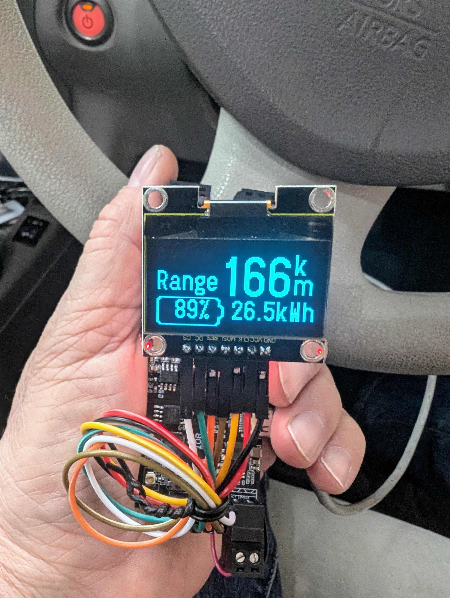
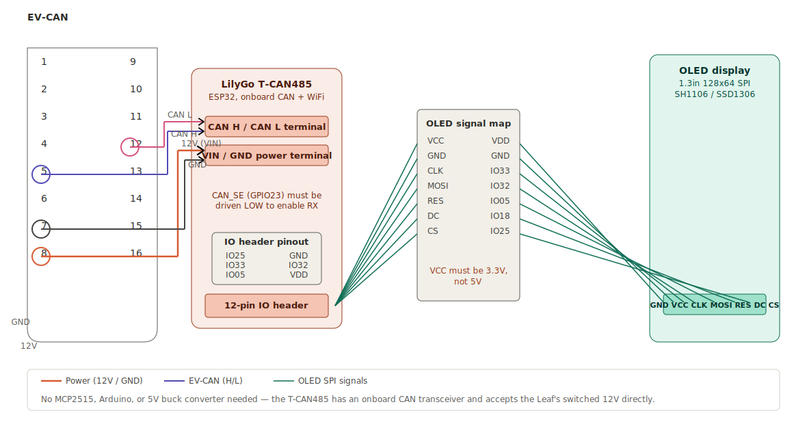
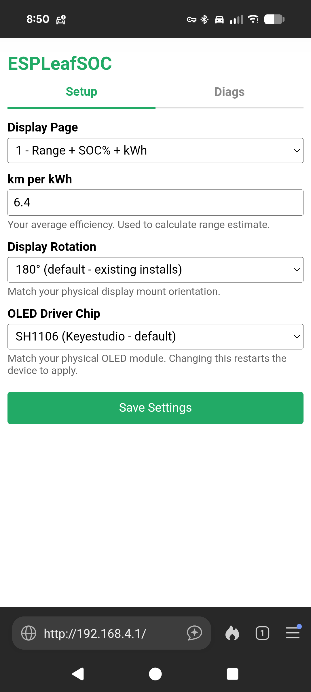
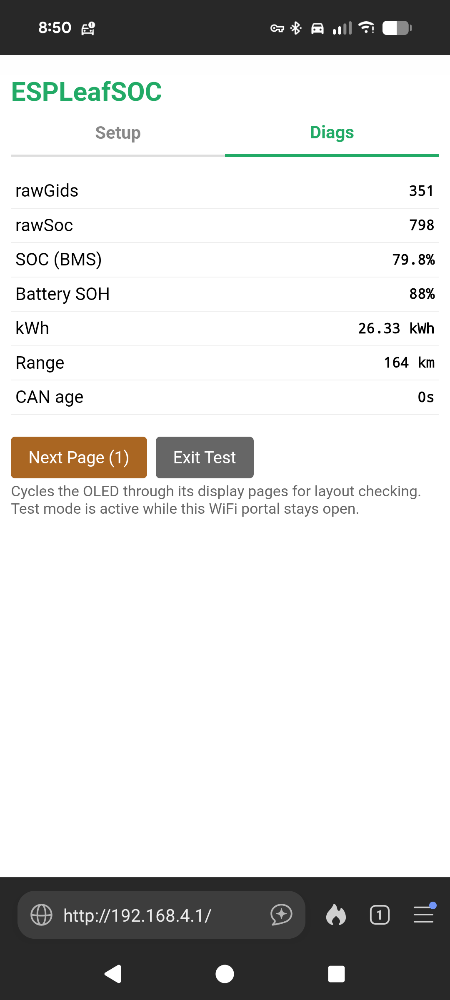

# ESPLeafSOC

A battery state-of-charge and range display for early Nissan Leaf (ZE0, 2011-2012) vehicles, which have no factory SOC% display on the dash.

This is an ESP32 refactor of [Paul Kennett's LeafSOCdisplay](https://github.com/PaulKennett/LeafSOCdisplay), ported from an Arduino Nano + MCP2515 CAN module to a [LilyGo T-CAN485](https://lilygo.cc/products/t-can485) board. Configuration is done through a phone or laptop browser instead of HVAC button combinations, and the displayed battery percentage is read directly from the vehicle's own Battery Management System rather than estimated.

This build also supports ZE0s that have been retrofitted with larger aftermarket battery packs (30/40/62kWh) via community CAN-bridge adapters.



---

## What's different from Paul's original

- **ESP32 instead of Arduino Nano** — native CAN controller, WiFi and Bluetooth built in, far more memory and processing headroom
- **WiFi setup portal instead of HVAC button combos** — no more accidentally changing display mode by turning on your demister
- **SOC% read directly from the BMS** (CAN message `0x55B`) instead of estimated from battery GIDS — this automatically tracks real battery health/degradation with no manual calibration needed
- **Battery State of Health (SoH%)** available as a diagnostic figure, decoded from the same CAN message used for GIDS (`0x5BC`) — credit to [dalathegreat](https://github.com/dalathegreat/leaf_can_bus_messages) for documenting this
- **OLED driver chip (SH1106/SSD1306) selectable from the web portal** — no recompiling to support a different display module
- **A status LED** that pulses blue while booting/configuring, smoothly shifts green→red based on how fresh the CAN data is, and flashes white when you save a setting

---

## Hardware required

| Part | Notes |
|---|---|
| [LilyGo T-CAN485](https://lilygo.cc/products/t-can485) | ESP32 with onboard CAN transceiver and WiFi |
| 1.3" 128×64 OLED, SPI interface | SH1106 driver (e.g. Keyestudio KS0056) or SSD1306 (e.g. Seeedstudio) — both supported |
| OBD2 plug (male) | To tap into the Leaf's EV-CAN bus |
| Wire for the OLED connection | ~500mm tested and working |
| A case/enclosure | See [`/hardware/`](./hardware/) for 3D-printable housing options |

You do **not** need a separate MCP2515 CAN module, buck converter, or 5V regulator — the T-CAN485 has an onboard CAN transceiver and accepts the Leaf's switched 12V directly.

### Upgrading an existing Paul Kennett LeafSOCdisplay install

If you already have one of Paul's original Arduino-based units installed, the OLED's physical wiring pin order is different on the T-CAN485 to what his carrier PCB used. Rather than rewiring the ribbon cable, you can **optionally** use the **ESPLeafSOC OLED Adapter** — a small PCB that plugs into the existing OLED ribbon cable and remaps the pins to the T-CAN485's IO header layout. Gerber files are in [`/hardware/oled-adapter/`](./hardware/oled-adapter/) in this repo.

This adapter is entirely optional — it just saves you re-pinning or re-soldering the ribbon cable on an existing install. New builds, or anyone happy to wire the OLED directly, can skip it and follow the pin table below instead.

---

## Wiring



### OBD2 connector (power and EV-CAN)

| OBD2 pin | Connects to | Purpose |
|---|---|---|
| 4 | T-CAN485 GND | Ground |
| 8 | T-CAN485 VIN | Switched 12V (only powered when the car is on) |
| 12 | T-CAN485 CAN L | EV-CAN low |
| 13 | T-CAN485 CAN H | EV-CAN high |

Note: pin 8 on the Leaf's OBD2 connector is switched +12V — the device only powers up when the car is turned on. The standard OBD2 pin 16 (constant +12V) is deliberately *not* used, so there's no risk of accidentally leaving something powered 24/7 and draining the 12V battery.

### OLED display (SPI)

The T-CAN485's 12-pin IO header, viewed from the top (component side):

```
IO25    GND
IO33    IO32
IO12    IO05
IO35    IO34
VDD     IO18
VDD     GND
```

| OLED pin | T-CAN485 pin | Notes |
|---|---|---|
| VCC | VDD | **3.3V only — do not connect to 5V** |
| GND | GND | |
| CLK | IO33 | SPI clock |
| MOSI | IO32 | SPI data |
| RES | IO05 | Reset (note: not IO35 — that pin is input-only on the ESP32 and won't work here) |
| DC | IO18 | Data/command select |
| CS | IO25 | SPI chip select |

---

## Arduino IDE setup

1. Install the ESP32 board package (Espressif), **version 2.x** — not 3.x, which has breaking changes to the CAN driver this project uses.
   - File → Preferences → Additional Board Manager URLs, add: `https://raw.githubusercontent.com/espressif/arduino-esp32/gh-pages/package_esp32_index.json`
   - Tools → Board → Board Manager → search "esp32" → install the Espressif package, 2.x branch
2. Board settings (Tools menu):
   - Board: **ESP32 Dev Module**
   - Upload Speed: 921600
   - Flash Size: 4MB (32Mb)
   - Partition Scheme: Default 4MB with spiffs
3. Install these libraries via Library Manager:
   - **U8g2** (display)
   - **ESPAsyncWebServer** and **AsyncTCP** (web portal)
   - **FastLED** (status LED)
4. Open `ESPLeafSOC.ino`, select the right driver constructor for your OLED if needed (this can now also be changed later from the web portal — see below), compile and upload.

---

## First boot and setup

1. Power up the device (plug into the Leaf's OBD2 port, or use USB-C on the bench for testing).
2. The OLED will show a splash screen, then settle on whichever display page was last selected.
3. On your phone or laptop, connect to the WiFi network **`ESPLeafSOC`** (password: `leafsoc1`).
4. Open a browser to **`http://espleafsoc.local`** (or `http://192.168.4.1` if mDNS doesn't resolve on your device — this is common on some Android phones).
5. You'll see two tabs: **Setup** and **Diags**.

The WiFi portal stays open for 60 seconds after you last interact with it, then switches off automatically to save power. It reopens every time the device boots.

### Setup tab



| Setting | What it does |
|---|---|
| Display Page | Which of the 4 OLED pages to show during normal driving |
| km per kWh | Your average efficiency — used to calculate the range estimate |
| Display Rotation | 0° or 180° — match however you've physically mounted the OLED |
| OLED Driver Chip | SH1106 or SSD1306 — match your actual display module. Changing this restarts the device. |

### Diags tab



Live readouts, refreshing once a second:

- **rawGids** — raw battery capacity reading from CAN
- **rawSoc** — raw SOC value from the BMS
- **SOC (BMS)** — the percentage actually shown on the main display
- **Battery SOH** — the BMS's own State of Health estimate (whole percent)
- **kWh** — estimated energy remaining
- **Range** — estimated range in km
- **CAN age** — how long since the last CAN message was received (a few seconds or more usually means something's wrong with the connection)

There are also **Next Page** and **Exit Test** buttons here, which let you cycle the OLED through its display pages without needing to drive the car or wait for real data — handy for checking the display looks right after any changes.

---

## Display pages

| Page | Shows |
|---|---|
| 1 | Range (large) + battery icon + SOC% + kWh |
| 2 | Large battery graphic with SOC% inside + kWh below |
| 3 | Range only, large |
| 4 | Version, credits, and project links |

---

## How the SOC% figure works

Early versions of this project calculated the displayed percentage from the battery's GIDS reading (a coarse internal capacity unit), using a pack-size lookup table to know what "100%" should be. Live testing on a CAN-bridged 40kWh pack showed this didn't work well — the bridged pack's actual capacity didn't match any nameplate assumption, since the pack's State of Health (we measured 81.2% via LeafSpy) meant its real maximum capacity was well below any factory figure.

The fix: this project now reads the SOC% **directly from the vehicle's own BMS** (CAN message `0x55B`), which already accounts for the battery's actual current health. There's no pack-size setting to configure and nothing to calibrate — whatever the car's own dash logic would show (if early Leafs had a dash SOC% display) is what you get here.

Energy remaining (kWh) and range are still calculated from GIDS, since that figure updates with finer resolution than the BMS's 0.1% SOC steps.

---

## Hardware files in this repo

All physical design files (PCBs and 3D-printable parts) live under [`/hardware/`](./hardware/):

```
hardware/
├── oled-adapter/     Gerber files for the optional ESPLeafSOC OLED Adapter PCB
└── case/             3D-printable housing/case STL files
```

Full parts list, including the OLED adapter's connectors, is in [`BOM.md`](./hardware/BOM.md).

The case STL files are being redesigned to suit the T-CAN485 board and the OLED adapter — check this folder for the latest version rather than relying on a fixed file name, as it may change between releases.

---

## Credits

- **[Paul Kennett](https://github.com/PaulKennett/LeafSOCdisplay)** — original project, hardware design, and years of refinement on the Arduino Nano platform. This project wouldn't exist without his work.
- **[dalathegreat](https://github.com/dalathegreat/leaf_can_bus_messages)** — extensive open-source documentation of Nissan Leaf CAN bus messages, which made the Battery State of Health decode possible without needing a second CAN bus.
- **Claude (Anthropic)** — ESP32 refactor, code architecture, and web portal development assistance.
- **Ray (Mozzie-AU)** — hardware build, testing, and project direction for this fork.

---

## License

Same license terms as the original [LeafSOCdisplay](https://github.com/PaulKennett/LeafSOCdisplay) project.
